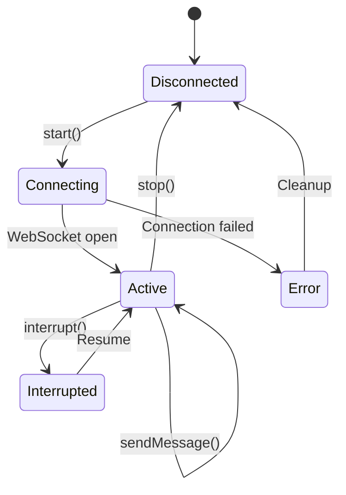

## Overview

Groupchat CLI embeds local AI agents directly into the chat experience. Agents run as child processes, communicate over WebSocket or stdio, and can execute tools with user permission. The current implementation includes Claude Code integration with extensible architecture for additional agents.

## Agent Architecture

### Core Components

The agent system consists of several layers:

1. **Session Adapter** (`src/agent/{agent}/session.ts`) - Manages agent lifecycle
2. **Session Registry** (`src/agent/core/local-agent-sessions.ts`) - Registers available agents
3. **Message Mutations** (`src/agent/core/message-mutations.ts`) - Normalizes agent messages
4. **Message Renderers** (`src/agent/core/message-renderers.tsx`) - Renders agent UI
5. **Chat View Base** (`src/primitives/create-chat-view-base.ts`) - Orchestrates agent mode

<Info>
From AGENTS.md: "If your agent is registered and available, the shared UI automatically handles mode transitions and routing."
</Info>

### Agent Lifecycle



## Claude Code Integration

Claude Code runs as a local process communicating over WebSocket SDK protocol.

### Session Creation

```typescript
// From claude/session.ts:426
export const createClaudeSdkSession = () => {
  const [isActive, setIsActive] = createSignal(false);
  const [isConnecting, setIsConnecting] = createSignal(false);
  const [messages, setMessages] = createSignal<Message[]>([]);
  const [pendingPermissions, setPendingPermissions] = createSignal<ClaudePendingPermission[]>([]);
  
  let server: Bun.Server | null = null;
  let cliSocket: ServerWebSocket | null = null;
  let claudeProcess: Bun.Subprocess | null = null;
  let sdkSessionId = "";
  
  // ... session implementation
};
```

### Starting Claude Session

```typescript
// From claude/session.ts:1107
const start = async () => {
  const runtimeCapabilities = getRuntimeCapabilities();
  if (!runtimeCapabilities.hasClaude || !runtimeCapabilities.claudePath) {
    const errorMessage = "Claude executable not found in PATH. Install Claude Code to use /claude.";
    setLastError(errorMessage);
    appendSystemMessage(errorMessage);
    return;
  }
  
  setIsConnecting(true);
  
  // Create WebSocket server for SDK protocol
  server = Bun.serve<CLISocketData>({
    port: 0,
    fetch(req, serverInstance) {
      const url = new URL(req.url);
      const match = url.pathname.match(/^\/ws\/cli\/([a-f0-9-]+)$/);
      if (match && match[1] === aRandomUUID) {
        const upgraded = serverInstance.upgrade(req, {
          data: { kind: "cli", routeId: aRandomUUID }
        });
        if (upgraded) return undefined;
      }
      return new Response("Claude SDK bridge", { status: 200 });
    },
    websocket: {
      open(ws) {
        cliSocket = ws;
        setIsActive(true);
        setIsConnecting(false);
        appendSystemMessage("Claude Code mode enabled. Type /exit to return to normal mode.");
        flushQueuedMessages();
      },
      message(_ws, raw) {
        handleIncomingRaw(raw);
      },
      close() {
        cliSocket = null;
        if (!isTearingDown) {
          stop("Claude websocket disconnected. Exiting Claude mode.");
        }
      }
    }
  });
  
  // Spawn Claude process
  const sdkUrl = `ws://127.0.0.1:${server.port}/ws/cli/${aRandomUUID}`;
  const args = [
    "--sdk-url", sdkUrl,
    "--print",
    "--output-format", "stream-json",
    "--input-format", "stream-json",
    "--verbose",
    "-p", ""
  ];
  
  claudeProcess = Bun.spawn([runtimeCapabilities.claudePath, ...args], {
    stdout: "pipe",
    stderr: "pipe",
    env: { ...process.env }
  });
};
```

<Tabs>
  <Tab title="WebSocket Protocol">
    - SDK URL provides bidirectional JSON streaming
    - Messages are newline-delimited JSON
    - Supports control requests, streaming events, and results
  </Tab>
  
  <Tab title="Process Management">
    - Claude spawned with `--sdk-url` for WebSocket bridge
    - stdout/stderr captured for diagnostics
    - Process exit triggers automatic cleanup
  </Tab>
</Tabs>

### Message Types

Claude sends various message types over the WebSocket:

```typescript
// From claude/session.ts:124
type ClaudeIncomingMessage =
  | ClaudeControlRequest        // Permission requests, interrupts
  | ClaudeAssistantMessage      // Completed responses
  | ClaudeStreamEventMessage    // Streaming text deltas
  | ClaudeStreamlinedTextMessage  // Simplified text stream
  | ClaudeStreamlinedToolUseSummaryMessage  // Tool summaries
  | ClaudeResultMessage         // Turn completion with metadata
  | ClaudeSystemInitMessage     // Session initialization
  | ClaudeAuthStatusMessage     // Authentication errors
  | ClaudeKeepAliveMessage;     // Connection heartbeat
```

### Handling Incoming Messages

```typescript
// From claude/session.ts:881
const handleIncomingMessage = (msg: ClaudeIncomingMessage) => {
  if (msg.type === "keep_alive") return;
  
  if (msg.type === "system" && msg.subtype === "init") {
    sdkSessionId = msg.session_id || "";
    return;
  }
  
  if (msg.type === "assistant") {
    removeStreamingMessage();
    const blocks = normalizeContentBlocks(msg.message?.content);
    const extractedText = extractTextFromBlocks(blocks);
    lastAssistantMessageId = appendClaudeResponse({
      id: msg.message?.id,
      content: extractedText,
      contentBlocks: blocks,
      parentToolUseId: msg.parent_tool_use_id ?? null,
      model: msg.message?.model,
      stopReason: msg.message?.stop_reason ?? null,
      eventType: "assistant"
    });
    return;
  }
  
  if (msg.type === "stream_event") {
    if (msg.event?.type === "content_block_delta" && 
        msg.event.delta?.type === "text_delta") {
      upsertStreamingText(
        msg.event.delta.text,
        msg.parent_tool_use_id ?? null,
        "stream_event"
      );
    }
    return;
  }
  
  if (msg.type === "result") {
    removeThinkingMessage();
    const resultMetadata = {
      subtype: msg.subtype || "success",
      isError: Boolean(msg.is_error),
      numTurns: msg.num_turns,
      totalCostUsd: msg.total_cost_usd,
      durationMs: msg.duration_ms
    };
    finalizeStreamingMessage(resultMetadata);
    emitCcEvent({
      event: "result",
      content: msg.is_error ? (msg.errors || []).join(", ") : "",
      isError: Boolean(msg.is_error)
    });
    return;
  }
  
  // ... handle other message types
};
```

<Note>
Streaming messages are incrementally updated and finalized when the result event arrives.
</Note>

## Tool Use Permissions

Claude requests user permission before executing tools.

### Permission Request Flow

```typescript
// From claude/session.ts:1009
if (msg.type === "control_request" && msg.request?.subtype === "can_use_tool") {
  removeThinkingMessage();
  finalizeStreamingMessage();
  
  const permission: ClaudePermissionRequest = {
    requestId: msg.request_id,
    toolName: msg.request.tool_name,
    toolUseId: msg.request.tool_use_id,
    agentId: msg.request.agent_id,
    description: msg.request.description,
    input: msg.request.input
  };
  
  emitCcEvent({
    event: "tool_call",
    toolName: permission.toolName,
    content: getToolOneLiner(permission.toolName, [
      { id: permission.toolUseId, input: permission.input }
    ])
  });
  
  appendPermissionMessage(permission);
  setPendingPermissions((prev) => [...prev, permission]);
}
```

### Responding to Permissions

```typescript
// From claude/session.ts:1350
const respondToPendingPermission = async (behavior: "allow" | "deny") => {
  const stack = pendingPermissions();
  const pending = stack[stack.length - 1];
  if (!pending) return;
  
  resolvePermissionMessage(pending.requestId, 
    behavior === "allow" ? "allowed" : "denied");
  setPendingPermissions((prev) => prev.slice(0, -1));
  
  if (stack.length <= 1) {
    appendThinkingMessage();
  }
  
  if (behavior === "allow") {
    sendToClaude({
      type: "control_response",
      response: {
        subtype: "success",
        request_id: pending.requestId,
        response: {
          behavior: "allow",
          updatedInput: pending.input
        }
      }
    });
  } else {
    sendToClaude({
      type: "control_response",
      response: {
        subtype: "success",
        request_id: pending.requestId,
        response: {
          behavior: "deny",
          message: "Denied by user"
        }
      }
    });
  }
};
```

<Warning>
Permissions are managed as a stack. The UI shows the most recent pending permission.
</Warning>

## Agent Events

Agents emit structured events for UI integration:

```typescript
// From claude/session.ts:147
export type CcBroadcast = {
  agentId: string;              // "claude"
  turnId: string;               // UUIDv7 for this conversation turn
  sessionId?: string;           // Agent session identifier
  event: "question" | "tool_call" | "text" | "result";
  content: string;
  toolName?: string;            // For tool_call events
  isError?: boolean;            // For result events
};
```

### Event Emission

```typescript
// From claude/session.ts:472
const emitCcEvent = (event: Omit<CcBroadcast, "turnId" | "agentId">) => {
  if (!currentTurnId) return;
  
  const payload: CcBroadcast = {
    agentId: AGENT_ID,
    turnId: currentTurnId,
    sessionId: ccSessionId || undefined,
    ...event
  };
  
  ccEventCallbacks.forEach((callback) => {
    try {
      callback(payload);
    } catch (error) {
      log("cc_event_callback_error", error);
    }
  });
};

// Subscribe to events
const onCcEvent = (callback: (event: CcBroadcast) => void) => {
  ccEventCallbacks.add(callback);
};
```

### Broadcasting to Channel

Agent events are broadcast to the active channel:

```typescript
// From channel-manager.ts:629
async sendAgentEvent(
  channelSlug: string,
  content: string,
  ccMeta: CcEventMetadata
): Promise<void> {
  const channelState = this.channelStates.get(channelSlug);
  if (channelState) {
    channelState.channel.push("new_message", {
      content,
      type: "cc",
      attributes: { cc: ccMeta }
    });
  }
}
```

<Info>
Agent events are ephemeral and fire-and-forget. Errors don't disrupt agent execution.
</Info>

## Interrupting Agents

Users can interrupt active agents:

```typescript
// From claude/session.ts:1400
const interrupt = () => {
  if (!isActive() && !isConnecting()) return;
  
  removeThinkingMessage();
  finalizeStreamingMessage();
  
  appendClaudeResponse({
    content: "Interrupted",
    contentBlocks: [],
    parentToolUseId: null,
    interrupted: true
  });
  
  sendToClaude({
    type: "control_request",
    request_id: randomUUID(),
    request: { subtype: "interrupt" }
  });
};
```

<Tabs>
  <Tab title="UI Integration">
    - Keyboard shortcut: Ctrl+C
    - Clears "Thinking..." message
    - Finalizes any streaming content
    - Sends interrupt control request
  </Tab>
  
  <Tab title="Known Control Requests">
    From claude/session.ts:20:
    - `initialize` - Session setup
    - `can_use_tool` - Permission request
    - `interrupt` - Cancel execution
    - `set_permission_mode` - Auto-allow configuration
    - `mcp_status`, `mcp_toggle` - MCP server management
  </Tab>
</Tabs>

## Message Metadata

Claude messages carry rich metadata:

```typescript
interface ClaudeMessageMetadata {
  parentToolUseId: string | null;
  contentBlocks: ClaudeContentBlock[];
  model?: string;
  stopReason?: string | null;
  streaming?: boolean;
  thinking?: boolean;              // Temporary status message
  interrupted?: boolean;
  permissionRequest?: ClaudePermissionRequest;
  eventType?: "assistant" | "stream_event" | "streamlined_text" | 
              "streamlined_tool_use_summary" | "result";
  result?: {
    subtype: string;
    isError: boolean;
    numTurns?: number;
    totalCostUsd?: number;
    durationMs?: number;
  };
}
```

### Content Blocks

```typescript
// From claude/session.ts:176
function normalizeContentBlocks(content: unknown): ClaudeContentBlock[] {
  if (!Array.isArray(content)) return [];
  
  const normalized: ClaudeContentBlock[] = [];
  
  for (const candidate of content) {
    if (!isRecord(candidate)) continue;
    
    if (candidate.type === "text" && typeof candidate.text === "string") {
      normalized.push({ type: "text", text: candidate.text });
      continue;
    }
    
    if (candidate.type === "thinking" && typeof candidate.thinking === "string") {
      normalized.push({
        type: "thinking",
        thinking: candidate.thinking,
        budget_tokens: candidate.budget_tokens
      });
      continue;
    }
    
    if (candidate.type === "tool_use") {
      normalized.push({
        type: "tool_use",
        id: candidate.id,
        name: candidate.name,
        input: candidate.input
      });
      continue;
    }
    
    if (candidate.type === "tool_result") {
      normalized.push({
        type: "tool_result",
        tool_use_id: candidate.tool_use_id,
        content: normalizeToolResultContent(candidate.content),
        is_error: candidate.is_error
      });
    }
  }
  
  return normalized;
}
```

## Adding New Agents

From AGENTS.md, adding a new agent requires:

<Steps>
  <Step title="Implement Session Adapter">
    Create `src/agent/{agent}/session.ts` with:
    - `start()`, `stop()`, `sendMessage()`
    - `isActive()`, `isConnecting()`, `messages()`
    - `appendError()`, `interrupt()` (optional)
  </Step>
  
  <Step title="Register in Local Agent Sessions">
    Edit `src/agent/core/local-agent-sessions.ts`:
    - Instantiate your session
    - Add `LocalAgentSessionEntry` with unique `id`
    - Gate with `isAvailable()` based on runtime
  </Step>
  
  <Step title="Add Runtime Capability Detection">
    Edit `src/lib/runtime-capabilities.ts`:
    - Add `{agent}Path` and `has{Agent}` fields
    - Detect binary availability (e.g., `Bun.which(...)`)
  </Step>
  
  <Step title="Add Enter Command">
    Edit `src/lib/commands.ts`:
    - Add command like `/{agent}` with `eventType: getAgentEnterCommandEvent("{agent}")`
  </Step>
  
  <Step title="Add UI Metadata">
    Edit `src/lib/constants.ts`:
    - Add to `AGENT_CONFIG` with `displayName` and `color`
  </Step>
  
  <Step title="Add Message Mutations (if needed)">
    Edit `src/agent/core/message-mutations.ts`:
    - Detect and normalize agent messages
    - Implement upsert/merge logic
  </Step>
  
  <Step title="Add Message Renderers (if needed)">
    Edit `src/agent/core/message-renderers.tsx`:
    - Custom UI for agent response types
    - Depth resolvers for nested threads
  </Step>
</Steps>

## Agent Mode UI

The ChatViewBase primitive manages agent mode:

```typescript
// Active agent triggers input mode change
const activeInputMode = createMemo<InputMode>(() => {
  if (!activeAgentId()) return "chat";
  
  const agent = localSessions.find(
    (entry) => entry.id === activeAgentId()
  )?.session;
  
  return agent?.pendingAction() ? "agent-action" : "agent";
});

// Command filtering
const isAgentAvailable = (agentId: string) => {
  return localSessions.some(
    (entry) => entry.id === agentId && entry.isAvailable()
  );
};
```

<Note>
Agent mode disables normal channel commands and shows agent-specific UI indicators.
</Note>

## Best Practices

<AccordionGroup>
  <Accordion title="Session Lifecycle">
    - Check runtime capabilities before starting
    - Handle both connecting and active states
    - Clean up processes, sockets, and state on stop
    - Append system messages for status changes
  </Accordion>
  
  <Accordion title="Message Streaming">
    - Upsert streaming messages incrementally
    - Finalize with result metadata when available
    - Remove "thinking" messages when content arrives
    - Limit buffered content for memory safety
  </Accordion>
  
  <Accordion title="Permission Management">
    - Queue permissions as they arrive
    - Show most recent pending permission in UI
    - Clear permission after resolution
    - Re-show "thinking" if more permissions queued
  </Accordion>
  
  <Accordion title="Event Broadcasting">
    - Generate unique turnId per conversation
    - Include sessionId for correlation
    - Fire-and-forget to avoid blocking
    - Log callback errors without throwing
  </Accordion>
</AccordionGroup>

## Related Documentation

<CardGroup cols={2}>
  <Card title="Messaging" icon="message" href="/features/messaging">
    Agent message format and attributes
  </Card>
  <Card title="Channels" icon="hashtag" href="/features/channels">
    Broadcasting agent events to channels
  </Card>
</CardGroup>